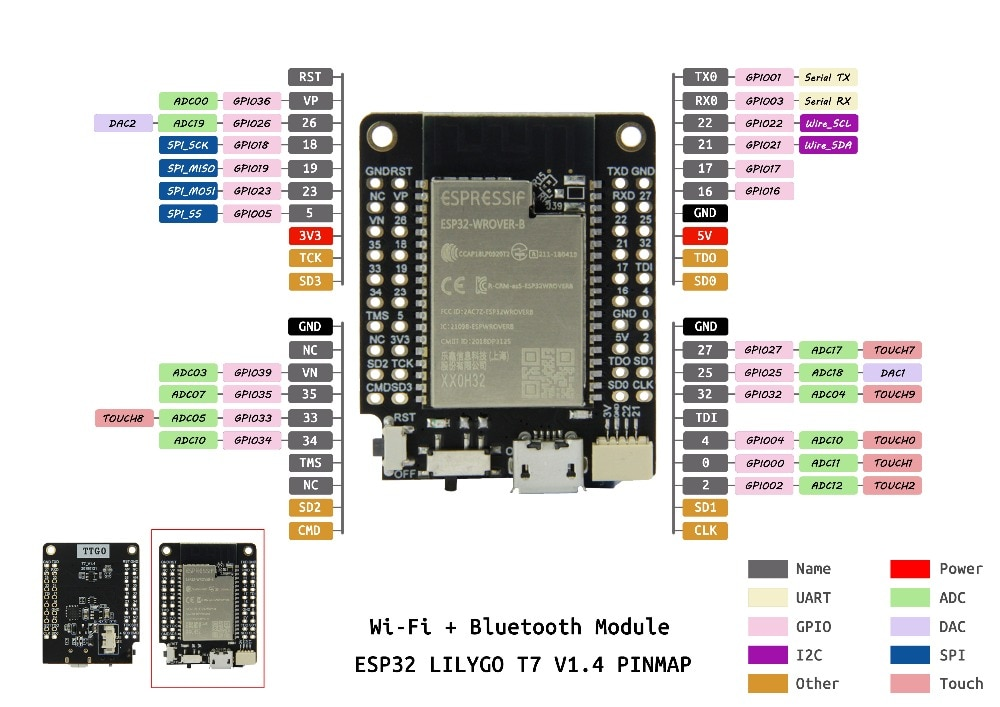
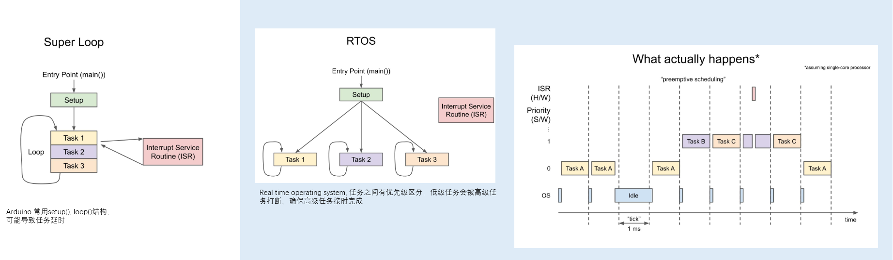
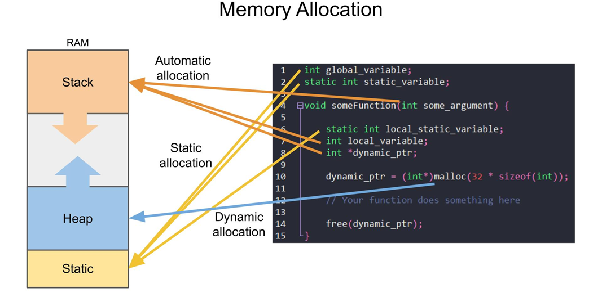
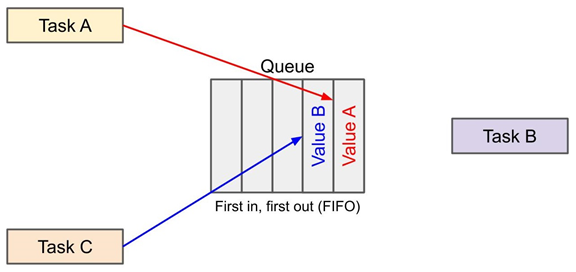
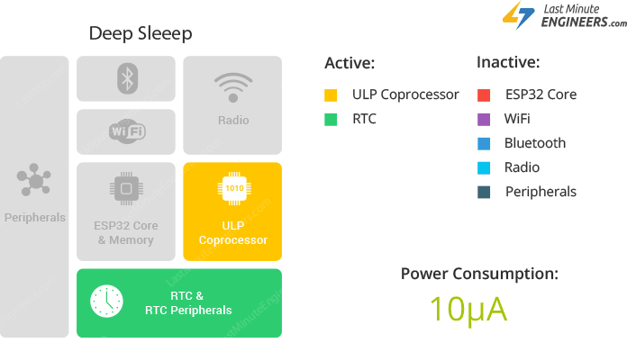

## ESP32 DevkitC Module

[ESP32 Boot Mode Selection](https://github.com/espressif/esptool/wiki/ESP32-Boot-Mode-Selection)

[IDF monitor](https://docs.espressif.com/projects/esp-idf/zh_CN/latest/esp32/api-guides/tools/idf-monitor.html)

[加电容 ](https://randomnerdtutorials.com/solved-failed-to-connect-to-esp32-timed-out-waiting-for-packet-header/)

[ESP32 pinout](https://circuits4you.com/2018/12/31/esp32-devkit-esp32-wroom-gpio-pinout/)

ESP32 DevkitC: **RAM:** 512 KB **Flash:** 4MB [详细介绍](https://medium.com/the-esp-journal/esp32-programmers-memory-model-259444d89387)

RAM中的328k是DRAM, 剩下的192k是 IRAM (instruction RAM)

> 而这320K的DRAM中，静态存储只有160K
>
> Due to a technical limitation, the maximum statically allocated DRAM  usage is 160KB. The remaining 160KB (for a total of 320KB of DRAM) can  only be allocated at runtime as heap. 

#### power up options

see this [blog](https://diyi0t.com/best-battery-for-esp32/)

1. power with USB with 5V input
2. power with VIN pin. This port is connected to a AMS1117 regualor which has a drop-out-range of 1.0V to 1.3V, so in order to get the desired 3.3V output for the chip the input must be at least 4.6V. see the [forum](https://esp32.com/viewtopic.php?p=21790#p21790)
3. power directly with the 3.3V pin, bypassing the onboard regulator. A LiFePO4 battery is recommended, which has a normal voltage of 3.2V and peak voltage of 3.65V.  The ESP32 chip can hold a voltage betweem 2.7V and 3.6V.

[电池和睡眠介绍](https://diyi0t.com/reduce-the-esp32-power-consumption/)

## LilyGO T7 V1.4 

Mini32 ESP32-WROVER-B PSRAM Wi-Fi Bluetooth Module

 QSPI flash 4MB / PSRAM 8MB 

 520 kB SRAM 



## 在VS code中搭建开发环境

1. 融合ESP IDF的Terminal, 步骤：进入文件夹，save as workspace, 在出现的`.code-workspace` json文件中写

   ```json
   "settings": {
   	"terminal.integrated.shell.windows": "cmd.exe",
   	"terminal.integrated.shellArgs.windows": [
   			"/k",
   			"D:/esp/esp-idf/export.bat"
   		]
   }
   ```

2. 导入各种头文件路径 (Include path)

   指定编译器路径：

   ```
   D:\Program Files (x86)\mingw-w64\i686-8.1.0-posix-dwarf-rt_v6-rev0\mingw32\bin\gcc.exe
   ```

3. tell C/C++ where to find the head files

   ```
   "D:\\Users\\Administrator\\.espressif\\tools\\xtensa-esp32-elf\\esp-2020r3-8.4.0\\xtensa-esp32-elf\\xtensa-esp32-elf\\**"
   ```

#### CmakeList.txt

为了成功编译，每个项目根目录下都要有一个CMakeList.txt

> cmake_minimum_required(VERSION 3.5)
>
> include($ENV{IDF_PATH}/tools/cmake/project.cmake)
> project(_rtos_blink_) #每次修改项目名为项目文件夹的名字

主要代码都放在main文件夹中，而且在main文件夹中需要另一个CMakeList.txt

> idf_component_register(**SRCS** "main.cpp" "../lib/AMG8833.cpp" "../lib/I2C.cpp"
>                     **INCLUDE_DIRS** "../lib")

#### 编译时间时间太长

[可能的一个解释](https://esp32.com/viewtopic.php?t=10541)

## ESP32相关

[多核线程](https://docs.espressif.com/projects/esp-idf/en/latest/esp32/api-guides/freertos-smp.html#)

#### GPIO

数字口

1. `    gpio_pad_select_gpio(LED);` 
2. 设置为输出: `gpio_set_direction(LED, GPIO_MODE_OUTPUT);` 
3. 输出高低电平: `gpio_set_level(LED, led_state);`

第二种方法是用`gpio_config_t`:

```c
#define GPIO_OUTPUT_IO_0 18
#define GPIO_OUTPUT_IO_1 19
gpio_config_t io_config=
{.intr_type = GPIO_PIN_INTR_DISABLE,//是否允许中断
 .mode = GPIO_MODE_INPUT,//输入还是输出
 /*bitmask是一个64位的变量(unsigned long long. ULL)，其每一位代表一个引脚*/
 .pin_bit_mask = ((1ULL<<GPIO_OUTPUT_IO_0) | (1ULL<<GPIO_OUTPUT_IO_1));//哪些引脚
 .pull_down_en = GPIO_PULLDOWN_ENABLE,//下拉电阻
 .pull_up_en = GPIO_PULLUP_DISABLE,//上拉电阻
};
gpio_config(&io_conf);//设置。
```

模拟口：**`#include "driver/adc.h"`**

1. `adc1_config_channel_atten(ADC1_CHANNEL_6, ADC_ATTEN_DB_11);`

   > 选择模拟信号口要用预设的常量而非GPIO号。ADC_ATTEN_DB_* 为选择测量范围，DB_0为最大1.1V
   >
   > DB_11为最大3.3 V

2. `int val = adc1_get_raw(ADC1_CHANNEL_6);` 任何测量范围，返回值都为0~4095

#### GPIO中断

[文档](https://docs.espressif.com/projects/esp-idf/en/latest/esp32/api-reference/system/intr_alloc.html)

[中断的分配与管理](https://www.esp32.com/viewtopic.php?t=12621)

```C
/*
    GPIO_PIN_INTR_DISABLE = 0,//禁止
    GPIO_PIN_INTR_POSEDGE = 1,//上升沿
    GPIO_PIN_INTR_NEGEDGE = 2,//下降沿
    GPIO_PIN_INTR_ANYEDGE = 3,//上升下降
    GPIO_PIN_INTR_LOLEVEL = 4,//低电平
    GPIO_PIN_INTR_HILEVEL = 5//高电平
*/
//初始化时设置中断
io_conf.intr_type = GPIO_PIN_INTR_POSEDGE;
gpio_config(&io_conf);
//也可以用单独的函数来设置
gpio_set_intr_type(GPIO_INPUT_IO_0, GPIO_INTR_ANYEDGE);
//install gpio isr service
gpio_install_isr_service(ESP_INTR_FLAG_DEFAULT);
//hook isr handler for specific gpio pin
gpio_isr_handler_add(GPIO_INPUT_IO_0, gpio_isr_handler, (void*) GPIO_INPUT_IO_0);
//remove isr handler for gpio number.
gpio_isr_handler_remove(GPIO_INPUT_IO_0);
```

#### esp-freertos

ESP32 默认跑freertos系统, 而且是esp自己的魔改版



| #include "freertos/FreeRTOS.h"<br />#include "freertos/task.h" |                                                              |
| ------------------------------------------------------------ | ------------------------------------------------------------ |
| **static** TaskHandle_t task1 = NULL;                        | 任务把手（必要）                                             |
| xTaskCreatePinnedToCore(read_serial, "readAlloc", 4000, NULL, 1, task1, 0); | 创建任务 (函数名，备注，分配内存，传给函数的参数，优先级（越大越优先），任务把手，指定CPU（0或1）) |
| vTaskDelay(delay /portTICK_PERIOD_MS);                       | 暂停当前任务，处理别的任务。<br />延时多少系统ticks, 除以系统每毫秒tick数，即得毫秒数 |
| vTaskSuspend(task1);                                         | 永久沉睡直到唤醒, 参数为NULL时沉睡自己                       |
| vTaskResume(task1);                                          | 唤醒                                                         |

#### ESP内存管理

ESP32-WROOM 内存分为3部分：静态存储区、柞 (Stack)、堆 (Heap)



全局变量，静态全局变量，静态局部变量：静态存储区

局部变量：栈 stack

动态申请的内存：堆 heap
|||
|---|----|
|  static char *str_ptr;|  首先要有一个指针    |
|str_ptr = (char *)malloc((idx) * sizeof(char)); | 申请内存用malloc函数，将返回的地址头赋给指针|
| printf("the string is %s\n",str_ptr);<br />free(str_ptr);<br />str_ptr = NULL; |用完后记得要释放内存，并让指针指向NULL防止变成野指针|

#### 队列Queue

当两个或多个任务共享一个变量时，引入队列作为缓存区，暂存写入的值。

变量值复制到队列中，队列的长度和其中每个元素的大小都要指定。



| \#include "freertos/queue.h"                            |                                      |
| ------------------------------------------------------- | ------------------------------------ |
| **static** xQueueHandle queue1;                         | 队列的把手                           |
| **static** **const** **uint8_t** queue_len = 3;         | 同时也要指定队列的长度               |
| queue1 = xQueueCreate(queue_len, sizeof(**uint16_t**)); | 创建一个队列，并将返回值赋给队列把手 |

接收端代码，xQueueReceive(队列把手，用于接收的**变量之地址**，等待系统tick数（设为0意味着立刻）)==pdTrue 说明收到了值

```c
char msgfrom2[str_len];
if (xQueueReceive(queue2,&msgfrom2,0)==pdTRUE){
    printf("message from queue2 is: %s\n",msgfrom2);
    }
```

发送端，

xQueueSend(队列把手，要发送的**变量之地址**，等待系统tick数（设为10即等10下tick）)

!=pdTrue 说明塞不进去，队列已满，拋出提示信息

```c
char msg[] = "Blinked";
     if (xQueueSend(queue2, &msg, 10) != pdTRUE)
     {
        printf("Queue2 is Full!\n");
     }
```

#### 软件计时器

在计时结束后调用回调函数

```c
#include "freertos/timers.h"
static xTimerHandle oneshot = NULL;
/*创建计时器*/
oneshot = xTimerCreate("one_shot",//计时器把手
                       4000 / portTICK_PERIOD_MS,//倒计时时间，
                       pdFALSE, //是否重复倒计时，
                       0, //计时器编号
                       mycallback); //回调函数	返回值赋给计时器把手
/*检查返回值，创建是否成功?*/
if (oneshot == NULL)
    {
        printf("create timer failed\n");
    }
/*若多个计时器绑定了同一个回调函数，
可以通过查看计时器编号来确认到底是哪个计时器的时限到了*/
void mycallback(TimerHandle_t xTimer)
{
    if (pvTimerGetTimerID(xTimer) == 0)
    {
          …
         }}
```

#### 硬件计时器

RTOS提供的软件计时器可以用于大多数情况，但有两个限制：

1. 计时器的最小分辨率为Rtos的Tick频率

2. 回调函数优先级较低

硬件计时器没有以上两个限制，但用起来颇为麻烦，但是在高优先级要求下必须用（因为硬件中断优先级最高）

```c
#include "driver/timer.h"
/*ESP32中所有硬件时钟的时钟源TIMER_BASE_CLK 均为80MHz
预分频可以是2~65535*/
uint16_t prescale = 80;
uint64_t alarm_value = (TIMER_BASE_CLK / prescale) * (delay_ms / 1000);
const timer_config_t hw_timer_config = {
        .divider = prescale,
        .counter_dir = TIMER_COUNT_UP,
        .counter_en = TIMER_START,
        .alarm_en = TIMER_ALARM_EN,
        .auto_reload = reload,
        .intr_type = TIMER_INTR_LEVEL};
timer_init(group_num, timer_num, &hw_timer_config);
/*设置计时器初值和终值*/
timer_set_counter_value(group_num, timer_num, 0);                       
timer_set_alarm_value(group_num, timer_num, alarm_value);
/*绑定回调函数（组号0或1，组内编号0或1, 回调函数名，
             传给回调函数的参数，将回调函数写入RAM）*/
timer_isr_callback_add(group_num, timer_num, isr, 
                       (void *)group_num, ESP_INTR_FLAG_IRAM);
/*正式启动*/
timer_start(group_num, timer_num);
```

1. 回调函数必须是 bool timer_isr_t (void *)类型，即传入一个Void指针，返回一个Bool值。不这样做会有烦人的Warning（虽然仍可以编译和运行）*

2. 在函数名前加 IRAM_ATTR 意味着将这段ISR的代码写入IRAM，这样调用起来更快，毕竟ISR争分夺秒

3. 传入值必须是Int，然后还要强制转换成Void*，因为只有Int和Void指针的长度相同，进了ISR后再转回int

4. 进入ISR后，需要一个timer_spin_lock锁

5. 在ISR中Debug时，不能使用Printf()而要用est_printf() 否则程序崩溃（普通printf()需要spin_lock，但ISR恰恰不能被锁）

```c
bool IRAM_ATTR my_isr(void *group_num)
{
    timer_spinlock_take((uint32_t)group_num);
    // do something
    timer_spinlock_give((uint32_t)group_num);
    return 0;
}
```

#### Starvation

高等级任务可能一直占用资源，使低等级任务进行不了。解决方案：

1. 延时

2. 高优先级任务仅由中断唤起

3. Aging，任务等待时间越长，其优先级越高

> 如果任务一直不能进行，会触发看门狗，ESP32的双核中，默认设置下看门狗只有core0有。

#### 死锁


多个任务需要的mutex之间有重叠，当所有任务都拿一部分，但拿不全自己要的mutex时，死锁就发生了。

**解决方案一：**timeout，任何一个mutex拿不到就在一段时间后释放所有已经拿到的mutex给其它任务用。

```c
//拿第一个semaphore, xSemaphoreTake(semaphor把手,等待的tick数)
if (xSemaphoreTake(sema1, 10) == pdTRUE){
    //do something
}
/*尝试拿第二个Semaphore*/
if (xSemaphoreTake(sema2, 1000) == pdTRUE)
    {
      sprintf(buf, "Philosopher %i took chopstick %i", num, right);
      printf("%s\n", buf);
    }
else{xSemaphoreGive(sema1);} //拿不到第二个就返还第一个semaphore
```

**解决方案二：**结构形设计

1. 层级mutex (hierarchy)：给mutex标数，令其有先拿后拿的顺序。比如有两个任务（任务1、2）,都需要同样的两个mutex（mutex1、2）。让它们总是先拿1,再拿2。这样当任务1先开始，拿走mutex1后，任务2就必须等mutex1释放，而不是抢先一步把mutex2占了。

2. 引入仲裁者：同时只能有一个任务触发。单独再加一个mutex，每个任务开始前先检查此mutex可用否，在任务结束后归还。相当于把多个mutex的要求变为一个。

#### Event 机制

[Event loop](https://docs.espressif.com/projects/esp-idf/en/latest/esp32/api-reference/system/esp_event.html#esp-event-default-loops), [例子](https://github.com/espressif/esp-idf/blob/1067b28707e527f177752741e3aa08b5dc64a4d7/examples/system/esp_event/default_event_loop/main/main.c)

一个轮询机制，处理事件

一个Event由_event base_和_event id_组成

`event_loop_create`会创建一个用户自定义的loop

而`event_loop_create_default()`是会启动一个特殊的loop，专门用于系统事件（比如wifi）。

```c
event_handler_instance_register_with(loop_handle_t,
                                    event_base_t,
                                    int event_id,
                                    event_handler_t,
                                    void* event_handler_arg,
                                    event_handler_instance_t context)
```

最后一个参数context用于在删除loop前取消回调函数，本身其实就是一个void指针

#### WIFI

[WIFI官方文档](https://docs.espressif.com/projects/esp-idf/en/latest/esp32/api-guides/wifi.html), [ESP32网络结构](https://medium.com/@mahavirj/esp-idf-wifi-networking-3eaebd11eb43)

必要的头文件："esp_wifi.h" "nvs_flash.h"

ESP32使用lwip为TCP协议，lwip是一个轻量级的TCP/IP协议，只占用十几K的RAM和40K的ROM

wifi建立步骤：

1. lwip初始化
   * `esp_netif_init`
   * `esp_event_loop_create_default`
   * `esp_netif_create_default_wifi_sta/ap`
   * `esp_wifi_init` 装wifi驱动，必须用`WIFI_INIT_CONFIG_DEFAULT`为参数
   * 创建application task
2. wifi设置
   * 将设置写入`wifi_config_t`类型的变量中
   * `esp_wifi_set_mode`
   * `esp_wifi_set_config()`传入之前的设置变量
3. wifi启动
   * `esp_wifi_start()` 
   * wifi驱动给出`WIFI_EVENT_STA_START`事件，event_task回调自定义的application_task，在自定义回调函数中应尝试`wifi_connect()`
4. wifi 连接
   * `esp_wifi_connect()`调用内部函数
   * 成功连接则给出`WIFI_EVENT_STA_CONNECTED`事件，失败则是`WIFI_EVENT_STA_DISCONNECTED`事件
5. 取得IP地址
   * 从DHCP服务器取得IP地址后，给出`IP_EVENT_STA_GOT_IP`事件，到这一步才能认为WIFI连接成功。

#### UART

[UART文档](https://docs.espressif.com/projects/esp-idf/en/latest/esp32/api-reference/peripherals/uart.html)

[UART-to-standard IO stream](https://docs.espressif.com/projects/esp-idf/en/latest/esp32/api-reference/storage/vfs.html#standard-io-streams-stdin-stdout-stderr)

| 默认引脚 | Tx   | Rx   | 默认波特率 |
| -------- | ---- | ---- | ---------- |
| uart 0   | 1    | 3    | 115200     |
| uart 1   | 10   | 9    |            |
| uart 2   | 17   | 16   |            |

大部分开发板上，USB都和UART0相连。剩下的两个UART可以自由配置引脚（任何GPIO口），不必用默认引脚。比如，有的开发板上没有9,10引脚，并不意味着uart1不能用，只是要换个引脚。

通常，UART只需要两个引脚，即TX与RX。RTS\CTS 引脚用于flow control, 使接收端能够根据信息接收情况，控制发送端速度，避免发送端太快以至于丢失信息。[uart中的rts/cts是什么](https://www.silabs.com/documents/public/application-notes/an0059.0-uart-flow-control.pdf)

具体步骤：

1. 安装驱动。若指定了队列把手，就会发送uart事件 uart_event_t到该队列，包含了一些debug信息。如果没有指定队列来接收就是放弃了这些信息，对意外情况是一无所知。

```C
static QueueHandle_t uart0_queue;
uart_driver_install(EX_UART_NUM,	//uart_num_0/1/2
                    BUF_SIZE * 2, 	//rx缓存
                    BUF_SIZE * 2, 	//tx缓存
                    20, 			//队列长度
                    &uart0_queue,	//队列把手的指针，也可以是NULL
                    0);				//不知道
```

事件

```C
typedef enum {
    UART_DATA,              /*!< 是否有新数据*/
    UART_BREAK,             /*!< UART break event*/
    UART_BUFFER_FULL,       /*!< UART RX buffer full event*/
    UART_FIFO_OVF,          /*!< UART FIFO overflow event*/
    UART_FRAME_ERR,         /*!< UART RX frame error event*/
    UART_PARITY_ERR,        /*!< UART RX parity event*/
    UART_DATA_BREAK,        /*!< UART TX data and break event*/
    UART_PATTERN_DET,       /*!< 检测到特定字符（或字符序列） */
    UART_EVENT_MAX,         /*!< UART event max index*/
} uart_event_type_t;

typedef struct {
    uart_event_type_t type; /*!< 上述事件类型中的一个 */
    size_t size;            /*!< UART_DATA事件中，新数据字节数*/
    bool timeout_flag;      /*!< 没有新数据*/                       
} uart_event_t;
```

2. 设置波特率、引脚等……

```C
uart_config_t uart_config = {
        .baud_rate = 115200,
        .data_bits = UART_DATA_8_BITS,
        .parity = UART_PARITY_DISABLE,
        .stop_bits = UART_STOP_BITS_1,
        .flow_ctrl = UART_HW_FLOWCTRL_DISABLE,
        .source_clk = UART_SCLK_APB,
    };
uart_param_config(EX_UART_NUM, &uart_config);
uart_set_pin(EX_UART_NUM, 
             UART_PIN_NO_CHANGE, //tx
             UART_PIN_NO_CHANGE, //rx
             UART_PIN_NO_CHANGE, //rts
             UART_PIN_NO_CHANGE);//cts
```

3. 从缓存读取指定长度字节。这种方法不能根据末尾标识符来决定是否是一串完整的数据，除非一个一个读直到读到`'\n'`，比较傻。

```C
uint8_t* buf = (uint8_t*) malloc(READ_BUF_SIZE);
int buffered_size;
while(1){
    memset(buf, 0, READ_BUF_SIZE);
    uart_get_buffered_data_len(EX_UART_NUM, &buffered_size); //缓存中有多少数据?
    uart_read_bytes(EX_UART_NUM, buf, buffered_size, portMAX_DELAY);//读取到buf中
    /** buffered_size 也可以换成任意数字，比如10就是读10个字节
    	设置等待时间为max_dalay后，读不满指定数量就会一直等待;
    	否则就是等待一段时间，有多少就读多少
    */
    uart_write_bytes(EX_UART_NUM, (const char*) buf, buffered_size);//打印到串口
}

```

5. 根据内容决定是否读取缓冲。

   * 设置是否检测特定字符。uart在检测到特定字符（如'\n'）后会产生一个中断，发送UART_PATTERN_DET事件，可以用来读取一整行数据。

     ```C
     // UART以一串 连续、相同 的字符为同步信号
     #define PATTERN_CHR_NUM    (1) 
     //Set uart pattern detect function.
     uart_enable_pattern_det_baud_intr
         (EX_UART_NUM,
          '\n',			   //要检测的特定字符
          PATTERN_CHR_NUM, //一串中有几个
          9,//连续特定字符最大间隔，大于此间隔认为是不相关的两个字符
          0,//检测到一个特定字符后，到再次检测之间的时间。
          0);//从启动到第一次检测之间的时间
     //Reset the pattern queue length to record at most 20 pattern positions.
     uart_pattern_queue_reset(EX_UART_NUM, 20);
     ```

   * pattern detected事件会将检测到的pattern字符的位置存到一个pattern queue中，因此读取pattern字符的位置就知道是否出现了一整条信息，而且能够方便读取。

     >  The following APIs will modify the pattern position info: uart_flush_input, uart_read_bytes, uart_driver_delete, uart_pop_pattern_pos. It is the  application’s responsibility to ensure atomic access to the pattern  queue and the rx data buffer when using pattern detect feature. 

     ```c
     while(1){
         if(xQueueReceive(uart0_queue, (void * )&event, portMAX_DELAY)) {
             memset(buf, 0 , READ_BUF_SIZE);
             switch(event.type) {
                    	case UART_PATTERN_DET:
                     	/*读取pattern字符位置，-1为没找到*/
                         int pos = uart_pattern_pop_pos(EX_UART_NUM);
                     	if (pos == -1){
                             uart_flush_input(EX_UART_NUM);
                         	break;
                         }
                     	/*读取数据内容*/
                         uart_read_bytes(EX_UART_NUM, 
                                         buf, 
                                         pos, 
                                         100 / portTICK_PERIOD_MS);
                     	/*数据之后的N个字符就是pattern字符*/
                         uint8_t pat[PATTERN_CHR_NUM + 1];
                         memset(pat, 0, sizeof(pat));
                         uart_read_bytes(EX_UART_NUM, 
                                         pat, 
                                         PATTERN_CHR_NUM, 
                                         100 / portTICK_PERIOD_MS);
                         printf("received data: %s\n",dtmp);
                         break;
                     default:
                         ESP_LOGI(TAG, "uart event type: %d", event.type);
                         break;
             }
         }
     }
     ```

     

## 休眠模式

[官方文档](https://docs.espressif.com/projects/esp-idf/en/latest/esp32/api-reference/system/sleep_modes.html)

浅睡眠 light sleep: 停止CPU的时钟，**暂停**当前执行，恢复后从暂停的地方继续，内存都在

深睡眠 deep sleep：CPU断电，内存中的数据消失，恢复后**重启** app_main()。



深睡眠只有RTC时钟、RTC内存、ULP协处理器在工作

所以必要的数据要加`RTC_DATA_ARRT` 标识，以存储在RTC内存（沉睡不消失，不过断电仍消失）

> 默认存在RTC slow， 通过设置menuconfig option named `CONFIG_ESP32_RTCDATA_IN_FAST_MEM` 可以改到RTC fast, 把RTC slow全数留给ULP
>
> 也可以显式地设置 `RTC_FAST_ATTR` 或 `RTC_SLOW_ATTR`
>
> `RTC_FAST_ATTR` 有8K，但只能PRO_CPU用
>
> `RTC_SLOW_ATTR` 有8K，两个CPU，ULP协处理器都可以用


设置唤醒源：

```C
/*唤醒方式1：定时器
沉睡时间以微秒计*/
esp_sleep_enable_timer_wakeup(TIME_TO_SLEEP * uS_TO_S_FACTOR);
/*唤醒方式2：外部引脚
只能用一些特定的RTC引脚：0,2,4,12-15,25-27,32-39*/
//单个引脚唤醒源, 高电平或低电平唤醒
esp_sleep_enable_ext0_wakeup(GPIO_NUM_33,1);
//多个引脚唤醒源，任意高或全低唤醒
esp_sleep_enable_ext1_wakeup(BUTTON_PIN_BITMASK,ESP_EXT1_WAKEUP_ANY_HIGH);
//ESP_EXT1_WAKEUP_ALL_LOW
```

**RTC引脚号和GPIO号对应**

其中，GPIO34-39只能作为输入，而且没有内置拉高/拉低电阻

```
- RTC_GPIO0 (GPIO36)
- RTC_GPIO3 (GPIO39)
- RTC_GPIO4 (GPIO34)
- RTC_GPIO5 (GPIO35)
- RTC_GPIO6 (GPIO25)
- RTC_GPIO7 (GPIO26)
- RTC_GPIO8 (GPIO33)
- RTC_GPIO9 (GPIO32)
- RTC_GPIO10 (GPIO4)
- RTC_GPIO11 (GPIO0)
- RTC_GPIO12 (GPIO2)
- RTC_GPIO13 (GPIO15)
- RTC_GPIO14 (GPIO13)
- RTC_GPIO15 (GPIO12)
- RTC_GPIO16 (GPIO14)
- RTC_GPIO17 (GPIO27)
```

wake stub: 唤醒后第一时间运行的程序, 存放在RTC FAST MEMORY [说明](https://docs.espressif.com/projects/esp-idf/en/latest/esp32/api-guides/deep-sleep-stub.html)

ULP协处理器编程：居然是汇编，存放在RTC SLOW MEMORY [说明](https://docs.espressif.com/projects/esp-idf/en/latest/esp32/api-guides/ulp.html)

休眠中由上升下降沿唤醒? [一个可能的方法](https://www.esp32.com/viewtopic.php?t=8873)

#### ULP 唤醒

要从休眠模式中醒来还可以用ULP，ULP可以读取GPIO, ADC 和I2C.

> 先在idf.py menuconfig -> components -> esp32-specific 中启动ULP coprocessor 并分配RTC内存

[网上的例子（i2c）](https://github.com/wardjm/esp32-ulp-i2c)

[另一个比较好的例子](https://github.com/boarchuz/HULP/blob/fbc9b61d57c6b83079def9ddb6ced9c30d1f7bb7/src/hulp.cpp#L108-L184)

ULP自身有4个多用途寄存器（R0~R3）和一个计数器（可用于循环）

ulp程序储存在RTC_SLOW内存中，其指令和数据均为32bit

除了存放程序占用RTC_SLOW, 剩余的RTC_SLOW内存都可以作为寄存器访问

**程序开始**： 

```assembly
        .global entry
entry:
        /* code starts here */
```

**访问ulp变量** ： 任何在ulp程序中声明为global的变量，都会生成一个前缀为`ulp_*`的变量

```assembly
 .global measurement_count
 measurement_count:      .long 0
```

相当于

```C
extern uint32_t ulp_measurement_count;
```

**ULP指令集**

[ULP指令集](https://docs.espressif.com/projects/esp-idf/en/latest/esp32/api-guides/ulp_instruction_set.html)

```assembly
MOVE Rdst <- Rsrc (16bit signed)
//令全局变量数字+1
move r1, x // load address of x in r1
ld r0, r1, 0 // load data from x in r0
add r0, r0, 1 // increment r0
st r0,r1,0 // store r0 as new content of x

```

```assembly
ST Rsrc <- Rdst, offset
LD Rdst -> Rsrc, offset
```

**ULP指令集之外定义的模板**

```C
// Write immediate value into rtc_reg[low_bit + bit_width - 1 : low_bit], bit_width <= 8
WRITE_RTC_REG(rtc_reg, low_bit, bit_width, value)
```

>  **硬件ULP I2C是假的，淦** [详情](https://esp32.com/viewtopic.php?t=4623)
>
>  因为设计失误根本没用，必须用软件版本，见[这里](https://github.com/tomtor/ulp-i2c)

#### ULP 软件I2C

[官方文档](https://github.com/espressif/esp-iot-solution/tree/release/v1.1/examples/ulp_examples/ulp_i2c_bitbang/main)

直接控制引脚高低来I2C通信


对于有次级寄存器的I2C从设备（比如grideye amg8833）, 读取指定寄存器字节要按以下顺序：

>  Start, Write Address, Register Index, Repeat Start signal, Address with R/W bit =1, Read Data byte1 with ACK, ... , Read Data byte n with NACK, Stop condition signal.   

**用r3寄存器实现柞**

```
move \sr,next2
st \rx,r3,0
sub r3,r3,1
```

Note that `push` is not a real instruction, it translates to TWO assembly instructions!

This also assumes that `pos=.` is pointing to the last seen assembly instruction, not to the `move` instruction.

`read_intro` is called from `read8` or `read16` without new parameters, so the return address to `read8/16` is the most recent stack entry at `r3+4` and the return address to the caller of `read8/16` is at `r3+8` so the two parameters originally passed to `read8/16` are now at `r3+12` and `r3+16`

## power save mode

[DTIM](https://tech-brain.us/?p=327)

[wifi 802.11](https://zhuanlan.zhihu.com/p/21623985)

[esp power management docu](https://docs.espressif.com/projects/esp-idf/zh_CN/latest/esp32/api-reference/system/power_management.html)

[freertos tickless ide](https://www.freertos.org/low-power-tickless-rtos.html)

[issue: wifi always connected at second time](https://www.esp32.com/viewtopic.php?t=16622)


## C语言知识

#### 静态变量

* 静态从硬件上理解：在静态存储区中专门划出一块区域。

* 作用：

  1.隔离全局变量，global 与 static global 都存放在静态存储区，但全局变量在引入的其它源文件中也可见，可能引发错误。Static global 就只在当前文件中可见。

  2.保持变量持久：使函数中的局部变量在调用后不消失，且只需要初始化一次。

```C
void count(){
/*声明一个静态局部变量*/
static num = 0;
num++;
printf("%d\n",num);
} 
```

#### 字符串函数

**`#include <string.h>`** 

1. `str[idx - 1] = '\0';` 使用任何库函数前要确保末尾是\0

2. `strncmp(str1, str2, k) == 0;`或`memcmp(str1, str2, k) == 0;` 比较两个字符串前k个字符是否一致（==0）memory compare 比string N compare 快

3. `memset(buf, 0, str_len);` 将字符串内容全设为0（重置字符串）

4. `sprintf(buf,'string to be print %d', num)` 将任何变量打印到字符串

   ```c
   /*若成功返回当前光标位置，可用于连续打印，用法：*/
   char buf[20];
   int index = 0;
   int i;
   for (i=0;i<10;i++){
       index += sprintf(&buf[index],"string %d",num)
   }
   ```

5. `sscanf` 从字符串找值赋给变量 [文档](https://en.cppreference.com/w/c/io/fscanf)

   > %h代表半，%u代表unsigned int。如%hu 就是unsigned short
   >
   > 值得一提的还有%n，可以将本次读取的字符量赋给一个变量，本身不计数

   ```C
   /*读取一个整形数字到i，并将读取了多少字符数据的信息给pos*/
   assert(sscanf(s, "%d%n", &i, &pos) == 1);
   /*pos可以用于接下来的读取*/
   sscanf(s+pos,"%d",&j);
   ```

   

#### 指针的指针

有用的[blog](https://www.yanbinghu.com/2019/06/20/53981.html)

需要改变指针指向的值时，需要传入指针的指针

错误反例：


正确方法：


#### 编译错误：

1. 编译错误：a label can only be part of a statement and a declaration is not a statement

   出现在：switch(){case: }中

   原因：label之后不可以紧跟声明，哪怕加一行没用的代码都可以

   解决方法：在case: 之后接一个分号

   ``` c
   #include <stdio.h>
   int main () 
   {
       printf("Hello ");
       goto Cleanup;
   Cleanup: ; //This is an empty statement.
       char *str = "World\n";
       printf("%s\n", str);
   }
   ```

#### C/C++ 混编

C文件用gcc编译

`gcc -g -c ./lib/*.c -I ./include`

C++文件用g++编译

`g++ -g -c ./cpplib/*.cpp -I ./cppinclude/*.hpp`

main函数所在主文件用cpp来写，引入C的头文件时要用extern "C" 保护起来

```
extern "C"{
#include "some_C_header.h"
}
```

main.cpp 也用g++编译，编译选项要给到所有的目标文件和所有的头文件路径

`g++ -o f.exe ./main.cpp ./build/*.o -I ./include -I ./cppinclude`


## 无线数据传输

Node red, [github](https://github.com/node-red/linux-installers)

```bash
#启动 nodered
node-red-start
```

mosquitto, [config参数](https://mosquitto.org/man/mosquitto-conf-5.html)

```bash
#重启 mosquitto
sudo systemctl restart mosquitto
#设置开机自启
sudo systemctl enable mosquitto.service
```

#### MQTT知识

* $SYS 主题：只读，由broker发送，描述一些关于broker的信息。[详情](https://github.com/mqtt/mqtt.org/wiki/SYS-Topics)
* 通配符，#代表之下所有层级，+代表某一层级 

连接后总是先断开

> This sometimes happens, when one programm is running twice an connects from the same IP with the same client ID. The broker than closes the "old connection" wich is still held by the process running in the background.  [github](https://github.com/eclipse/paho.mqtt.python/issues/174)

原因，用了相同的client id 导致服务器想关掉旧进程，结果关的是现在的进程

解决方法：每次重启后用一个随机的client name

#### Nodered 可视化

在flow视图内展示图片：image-tools viewer，[代码](https://discourse.nodered.org/t/how-to-generate-an-image-from-the-8x8-raw-heat-map-data-of-an-amg8833-thermal-sensor/31604/7)

颜色格式转化：[blog](https://css-tricks.com/converting-color-spaces-in-javascript/)

热力图格式：[stackoverflow](https://stackoverflow.com/questions/12875486/what-is-the-algorithm-to-create-colors-for-a-heatmap)

## 图像处理

blob: binary large object, 是一些连续的像素点的集群

1. 设定阈值，将图片转为非黑即白
2. 分组
3. 融合邻近的组
4. 计算质心以及半径

形态学处理，dilation和erosion [blog](https://blog.csdn.net/wsp_1138886114/article/details/82917661)

#### 移植到C语言

[快速高斯博文](https://rastergrid.com/blog/2010/09/efficient-gaussian-blur-with-linear-sampling/)

[快速高斯的几种方法](https://scicomp.stackexchange.com/questions/10356/computational-complexity-of-2d-convolution)

[快速区域求和](https://en.wikipedia.org/wiki/Summed-area_table#The_algorithm)

## RTC 存储

[结构体size优化](https://mezzantrop.wordpress.com/2016/10/28/structure-size-optimization-in-c/)